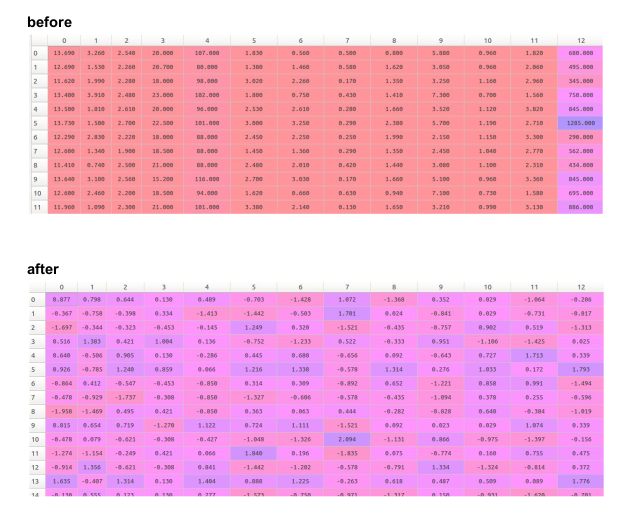
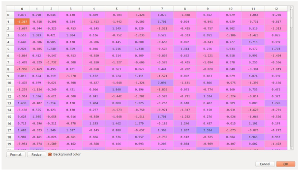
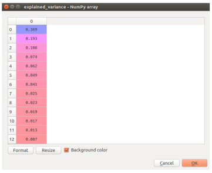
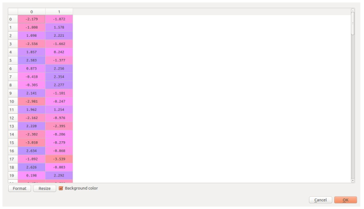
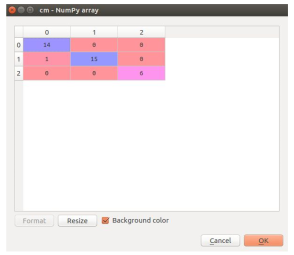
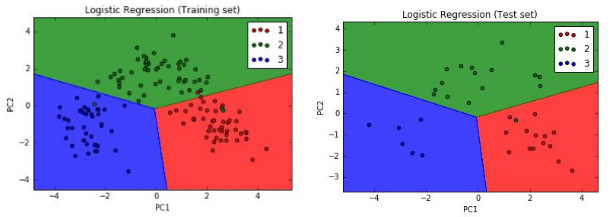

# Wine Data Set - A Case Study using Logistic Regression and PCA
GUIDE: Dr. M Sudheep Elayidom

These data are the results of a chemical analysis of wines grown in the same region in Italy
but derived from three different cultivars. The analysis determined the quantities of 13
constituents found in each of the three types of wines.

In a classification context, this is a well posed problem with "well behaved" class structures.
Since we can't visualise the results with 13 attributes, we need to apply dimensionality
reduction techniques.

StandardScaler ​ is used to normalize the data. Feature Scaling is done for the algorithm to
converge faster.

We can’t visualise the results with 13 attributes. So we have to apply dimensionality
reduction techniques such as Principal Component Analysis (PCA) or Linear Discriminant
Analysis (LDA).We have used ​ PCA (Principal Component Analysis) ​ for dimensionality
reduction.

When we apply PCA, we get two principal components with maximum variance. Only the
attributes with larger variance will contribute better for the results. This is understood by
observing the ​ explained variance matrix.

The ​ PCA algorithm reduces the 13 attribute dataset into 2 principal components​ as
shown below.

The ​ confusion matrix​ is constructed to find out the accuracy of prediction. The diagonal
elements are the correctly predicted outputs. The other cell elements are the incorrectly
predicted outputs.

We are using​ Matplotlib.pyplot ​ python library to visualise the results. We are using a mesh
grid to plot the results. The training set and test set data is visualised. There are 3 prediction
regions.
The green dot in blue region is an ​ outlier​ .

